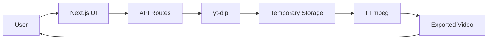
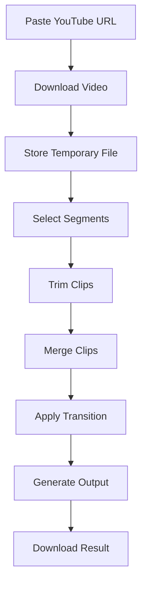
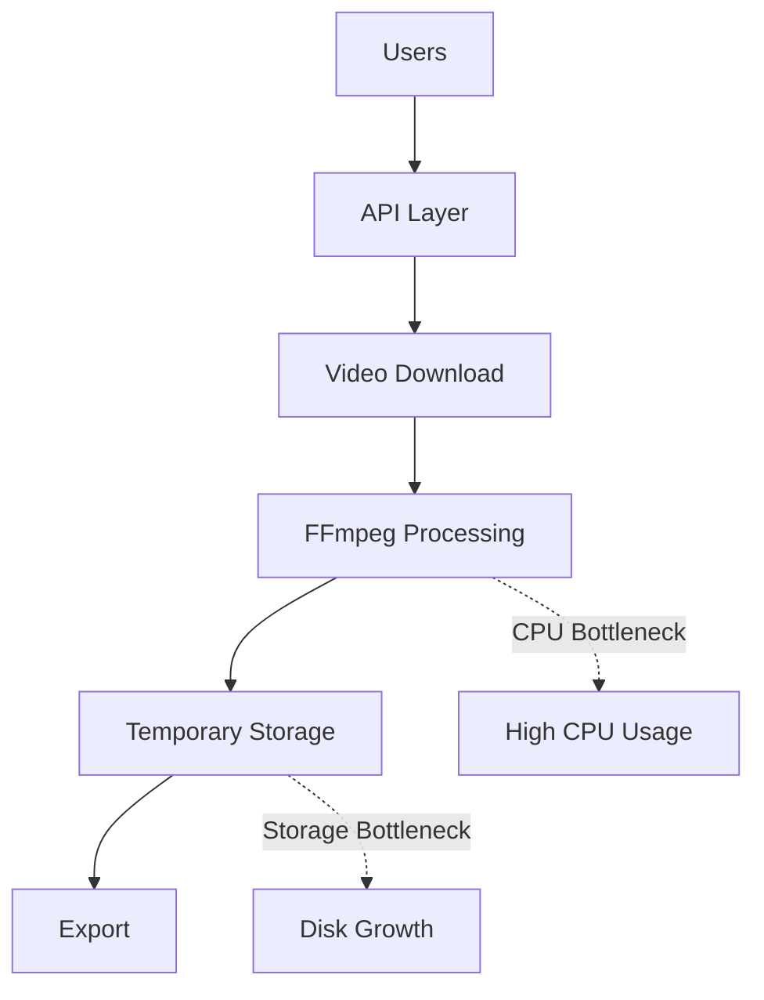
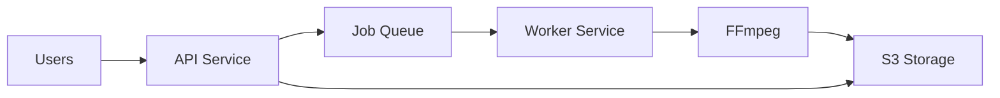
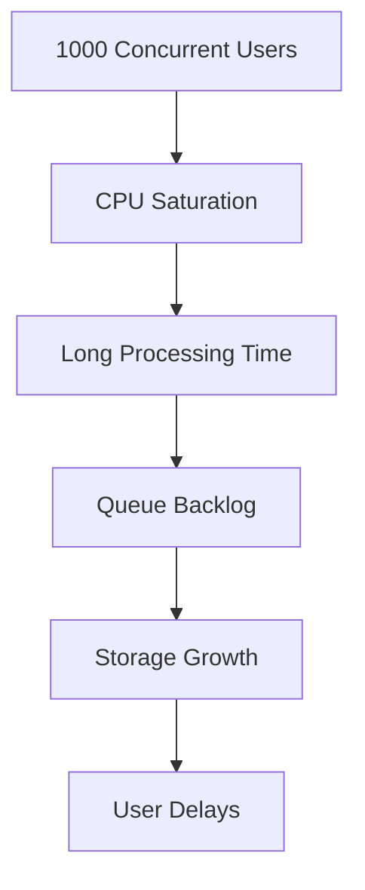

# Architecture Diagram Templates

## MVP Architecture

---

## Video Processing Flow

---

## Resource Bottlenecks

---

## Future Scalable Architecture

---

## Scaling Discussion

---

## Design Tradeoffs

### Chosen For MVP

* Local storage
* Single service
* Synchronous processing
* Simple deployment
* Minimal infrastructure

### Deferred

* Job queue
* Worker fleet
* Distributed storage
* Auto scaling
* Multi-tenant architecture

Reason:

The challenge prioritizes a working MVP within 2 hours rather than production-scale infrastructure.
